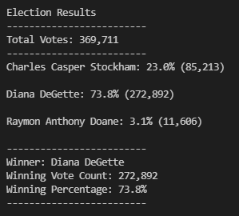

# Election_Analysis

## Project Overview
A Colorado Board of Elections employee has given you the following tasks to complete the election audit of a recent local congressional election.

## Deliverables 
1. Calculate the total number of votes cast. 
2. Get the complete list of the candidates who received votes. 
3. Calculate the total number of votes each candidate received.
4. Calculate the percentage of votes each candidate won.
5. Determine the winner of the election based on popular vote. 

## Resources
- Data Source: election_analysis.csv
- Software: Python 3.7.6, Visual Studio code, 1.60.2

## Election Results
The analysis of the election show that:
-  There were “369,711" votes cast in the election 
-  The Candidates were:
    - Charles Casper Stockham
    - Diana DeGette
    - Raymon Anthony Doane
- The candidate results were:
    - Charles Casper Stockham received "23%" of the vote and "85,213" number of votes.
    - Diana DeGette received "73.8%" of the vote and "272,892" number of votes.
    - Raymon Anthony Doane received "3.1%" of the vote and "11,606" number of votes.  
- The winner of the election was:
    - Diana DeGette, who received "73.8%" of the vote and "272,892" number of votes. 
- The Counties were:
    -Arapahoe
    -Denver
    -Jefferson
- The County results were:
    -Jefferson received "10.5%" of the votes and a total of "38,855" votes in the county.
    -Denver received "82.8%" of the votes and a total of "306,055" votes in the county. 
    -Arapahoe received "6.7%" of the votes and a total of "24,801" votes in the county.
 - County with the most votes was:
    -Devner County which received "82.8%" of the votes and a total of "306,055" votes for the county.

## Challenge Summary 
In this challenge we have created an effective and flexible script. The script automatically calculates the total votes, total votes by county, the votes by the candidate and the winning candidate as well as the percentages won. These categories could work for almost any election and we can easily modify it to fit other’s needs. For example, we could change the script to look at city or state elections. We could even look at voter turnout by county (or other municipality) to create more dynamic polling data.
